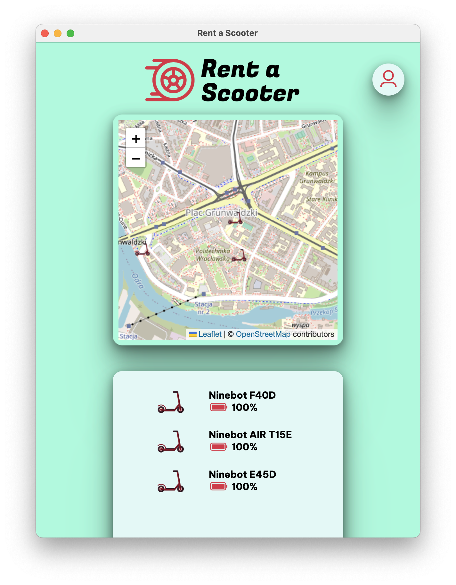
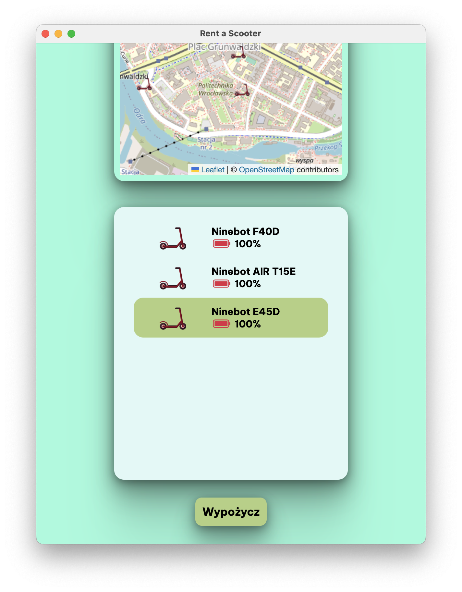
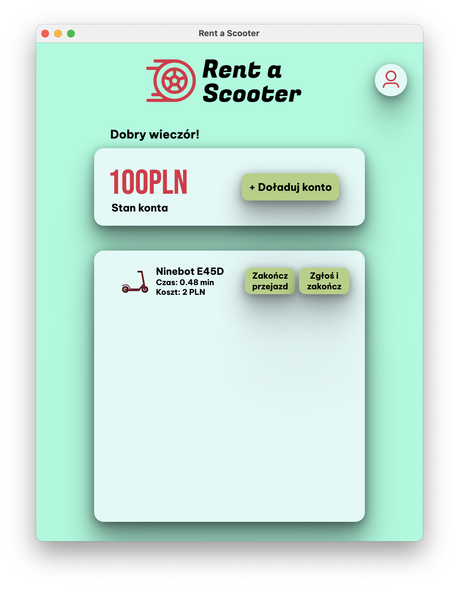
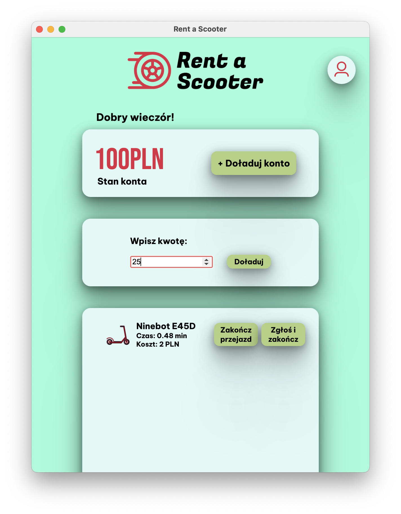
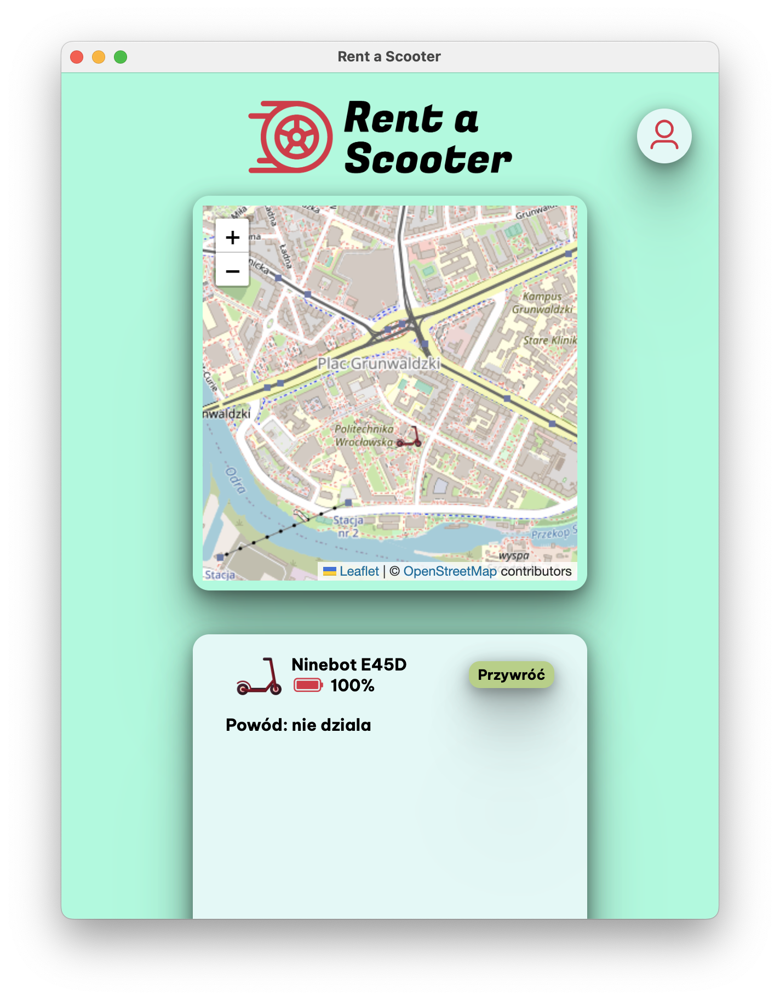

# Rent a Scooter

React + TypeScript frontend for a scooter rental Electron app. Created for a college Databases 2 course.

## User
### User view
- Display available scooters in the area
- Check scooter location on a map
- See scooter's battery charge
- Pick and rent!
  
  

### User panel
- Check account's balance
- Top up account's balance
- End a ride, or end and report a faulty scooter
- Check current ride's cost and rented period

 

## Staff
### Service view
- See user reported scooters with a reason attached
- Find faulty scooters directly on a map
- Restore repaired scooters to the database

### Admin
- See every scooter in the database
- Add a new scooter
- Permanently delete a scooter

## Available scripts

### `npm start`

Runs the app in the development mode.\
Open [http://localhost:3000](http://localhost:3000) to view it in the browser.

### `npm run electron`

Opens an Electron window. Must be run after `npm start` (utilizes port 3000).